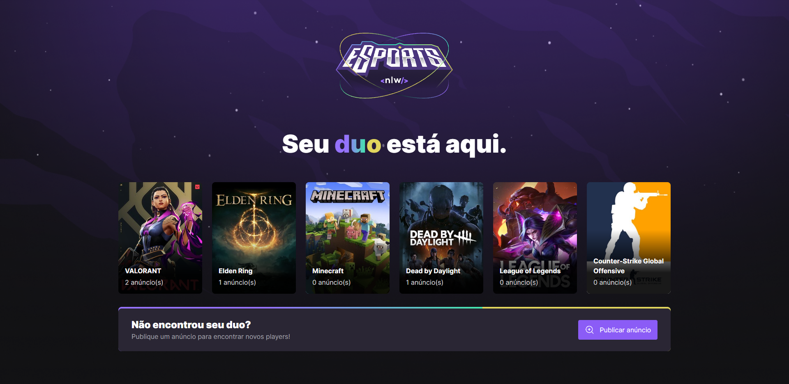
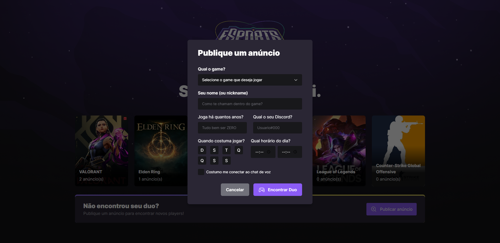

<h1 align="left"> 🎮 Find Your Duo - Web</h1>

O Find Your Duo (versão Web) é um projeto que foi desenvolvido durante a semana do evento NLW eSports disponibilizado pela <a href="https://www.rocketseat.com.br/">Rocketseat</a>.

Esse projeto possui o objetivo de ajudar os players a encontrarem um parceiro ou uma parceira para jogarem juntos os seus jogos favoritos. 

Na versão web do projeto, será onde o player poderá criar novos anúncios, e para isso é necessário que ele abra o formulário através do botão "Publicar anúncio", preencha todos os campos e, após isso, clicar em "Encontrar Duo", para que seu anúncio seja publicado e outros players consigam encontrá-lo utilizando a versão mobile do Find Your Duo.

 

## 🚀 Tecnologias utilizadas

 
 
 
 

 

## 📷 Design do projeto

